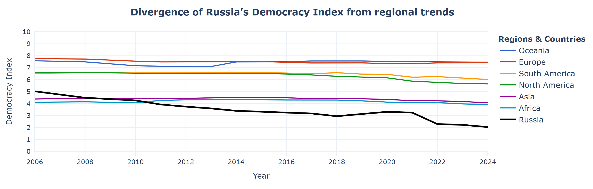

# 📊 Democracy Index Visualization (2006–2024)

## 📌 Project Overview
This project presents a data visualization analysis of global democracy trends using the Democracy Index dataset by the Economist Intelligence Unit. The goal is not just to plot the data, but to communicate a clear and meaningful insight through a single, well-designed visual.

The main focus of the project is to compare **regional democracy trends over time** and highlight how **Russia’s trajectory diverges from broader patterns**.

---

## 📂 Dataset
The dataset contains:
- Country-level Democracy Index scores (0–10)
- Years: 2006–2024
- Region classification (OWID)

### Key columns:
- `Entity` — country name  
- `Year` — observation year  
- `Democracy Index` (democracy_eiu) — democracy score  
- `World region according to OWID` (owid_region) — region  

---

## 📈 Main Visualization
The core visualization is a **line chart (Plotly)** showing:
- Average Democracy Index by region over time  
- Russia as a separate highlighted line



👉 [Interactive version](https://riabovpetr.github.io/assignment-Plotly/index.html)

### Insights and Findings:
- Global democracy trends are not uniform — regions follow different trajectories, and Russia shows a noticeable divergence from broader regional patterns.
- The average democracy index has declined across all regions, most sharply in North America, by nearly a full point, and in South America, by about half a point, over the past 18 years.
- During the same period, **Russia’s democracy index has plummeted dramatically, falling by three points, compared with a modest decline of 0.3 points in Europe and 0.3 points in Asia**.

---

## 🛠️ Tools & Technologies
- Python  
- pandas (data manipulation)  
- Plotly (interactive visualization)  
- Jupyter Notebook  

---

## ⚙️ How It Works
1. Data is loaded by url  
2. Aggregation:
   - Democracy Index is averaged by region and year  
3. Visualization:
   - Line chart is built using Plotly  
   - Russia is added as a separate trace for comparison  

---

## 🎨 Design Decisions
- **Line chart** chosen for time-series comparison  
- **Y-axis fixed (0–10)** to preserve interpretability  
- **Minimalist layout** to maximize data-ink ratio  
- **Color used only for grouping** (regions vs. Russia)  
- **Adjusted axis spacing** to avoid label overlap  

---

## 🚀 How to Run
1. Clone the repository:
```bash
git clone https://github.com/riabovpetr/assignment-Plotly.git
```

2. Install dependencies:
```bash
pip install pandas plotly
```

3. Run the notebook:
```bash
jupyter notebook
```
